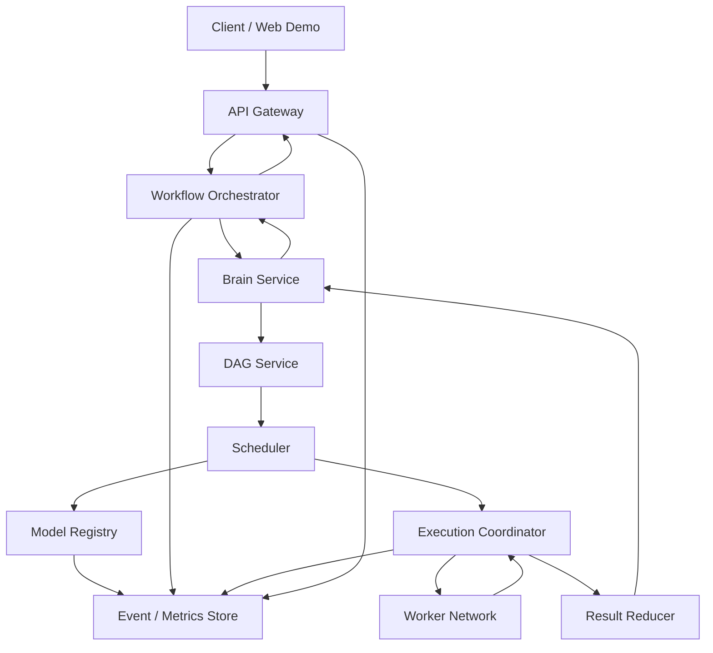

# ModelFlow 系统整体架构

## 1. 文档目的

本文描述 ModelFlow 的系统边界、分层、核心组件和端到端运行关系。
本文不定义 DAG 节点协议、依赖校验或调度算法细节。
这些内容见 [DAG_ARCHITECTURE.md](DAG_ARCHITECTURE.md)。
本文不定义模型注册、心跳或负载均衡的字段与策略细节。
这些内容见 [MODEL_REGISTRY.md](MODEL_REGISTRY.md)。

## 2. 系统定位

ModelFlow 是面向模型互联网的动态混合 DAG 调度引擎。
它将自然语言任务转换为可执行的任务图。
系统把图中相互独立的工作分发到异构模型节点并发执行。
系统把存在强依赖、需要审查或需要综合推理的工作交给串行或协作执行路径。
最终结果由首脑模型统一整合并以稳定接口返回给调用方。
ModelFlow 的目标是协调模型计算网络，而非训练或替代底层模型。

## 3. 核心问题

模型互联网拥有大量能力、性能、硬件和网络条件不同的模型节点。
单体模型将许多彼此独立的子任务串行处理，造成不必要的等待。
固定工作流无法适应不同任务的依赖结构和实时节点状态。
自由文本的模型间通信难以验证、重试、聚合和观测。
ModelFlow 通过任务图、能力感知与结构化协议解决上述问题。

## 4. 设计目标

- 自动理解自然语言任务并生成可执行计划。
- 以统一 DAG 表示子任务、依赖和执行策略。
- 根据能力、在线状态、时延和负载选择 Worker。
- 对无依赖节点实施并发调度。
- 支持串行、委员会、审查和归约等质量增强路径。
- 对超时、失败和格式异常提供可追踪的恢复能力。
- 为 REST 调用方和 Web Demo 提供实时过程可视化。
- 保持控制面和数据面解耦，允许节点动态加入或离开。

## 5. 非目标

当前 PoC 不包含新模型训练、微调、蒸馏、联邦学习或 RLHF。
当前 PoC 不承诺跨地域强一致调度和超大规模集群部署。
当前 PoC 以文本任务和结构化 JSON 输出为主。
系统不直接管理 GPU 驱动、容器编排或模型权重分发。
这些能力可由外部基础设施提供，并通过 Worker 适配层接入。

## 6. 架构原则

Brain 负责规划、决策、异常处置和最终表达，不承担所有细粒度工作。
Worker 只执行边界清晰、输入输出受约束的子任务。
模块之间通过版本化 JSON API 和领域事件通信，不共享进程内可变状态。
状态变更必须可观测，长任务必须可取消、超时和重试。
调度决策基于能力画像与实时状态，而非随机选点。
新增 Worker、能力、执行策略和调度算法不应改变既有调用协议。

## 7. 逻辑视图

客户端只面对任务提交、查询、取消和结果读取接口。
编排层维护一次运行的状态机，并协调其他领域服务。
控制面由 Brain、DAG、Scheduler 与 Registry 组成。
数据面由 Execution Coordinator、Worker Adapter 与底层模型服务组成。
可观测性组件旁路接收状态事件，不参与调度关键路径的业务决策。

## 8. 分层模型

### 8.1 接入层

接入层向 Web Demo、REST 客户端和后续 SDK 暴露稳定 API。
它负责鉴权、请求校验、限流、请求标识生成与响应序列化。
接入层不执行任务拆解，不直接调用 Worker。
异步任务通过 `run_id` 返回，调用方可轮询或订阅事件流。

### 8.2 编排层

编排层是一次任务运行的唯一状态所有者。
它创建运行上下文，驱动计划、执行、归约和完成等阶段迁移。
它将外部 API 请求转换为领域命令，并发布可视化所需的事件。
编排层不保存 Worker 的权威能力信息。

### 8.3 智能决策层

智能决策层包含 Brain Service、DAG Service 与 Scheduler。
Brain 将用户意图转成受 Schema 约束的规划请求。
DAG Service 负责生成和静态验证任务图。
Scheduler 读取图的就绪节点和 Registry 快照，输出分派决策。
这些服务可以先以同一进程模块实现，接口仍保持独立。

### 8.4 执行层

执行层将调度决策转为实际的远程模型调用。
Execution Coordinator 负责并发控制、超时、取消、重试和结果归一化。
Worker Adapter 屏蔽 HTTP、RPC、队列或本地推理引擎的传输差异。
执行层不得把某个厂商的响应格式泄漏到上层。

### 8.5 模型网络层

模型网络层由可动态变化的 Brain、Worker 与协作模块组成。
每个网络节点以声明式能力和健康状态暴露自身，而不是由调度器硬编码。
同一个物理节点可以通过不同端点暴露多个模型或能力版本。
模型网络细节由 Model Registry 统一管理。

### 8.6 结果与呈现层

Result Reducer 将多个规范化结果转换为中间上下文包。
Brain 依据用户目标生成最终答案、报告、表格或结构化对象。
Web Demo 同时呈现最终结果、DAG、节点状态、时间线和性能指标。
呈现层读取运行快照与事件流，不反向修改调度状态。

## 9. 核心组件

### 9.1 API Gateway

API Gateway 提供 `POST /runs`、`GET /runs/{run_id}` 和取消接口。
它为每个请求分配关联 ID，并把用户身份与请求配额写入运行上下文。
同步短任务可等待完成；默认模式应使用异步运行接口。
请求体必须包含用户目标、可选输入数据和输出约束。

### 9.2 Workflow Orchestrator

Workflow Orchestrator 管理一次 `run` 的生命周期。
它顺序驱动 `RECEIVED`、`PLANNING`、`SCHEDULING`、`EXECUTING`、`REDUCING` 和终态。
它保存 DAG 版本、调度尝试、节点执行记录和最终产物索引。
它是 API 查询运行状态的主要来源。

### 9.3 Brain Service

Brain Service 是全局控制中枢和语义决策者。
它解析意图、选择任务模式、生成或修订计划，并决定最终归约提示。
它可建议重分配、降级、补跑或进入委员会和审查路径。
Brain 的输出必须经过 Schema 校验，不能直接驱动未经验证的执行。

### 9.4 DAG Service

DAG Service 将 Brain 计划转成统一的不可变 DAG 定义。
它执行节点 ID 唯一性、依赖存在性、无环性、输入绑定和策略合法性校验。
它计算初始就绪节点集合，供 Scheduler 读取。
它不选择具体 Worker，也不执行远程调用。

### 9.5 Scheduler

Scheduler 根据就绪节点、节点约束和 Registry 快照生成 assignment。
它负责选择候选集、估算成本、控制并发配额和决定冗余执行条件。
调度结果必须包含决策依据，以便审计和可视化。
Scheduler 不持久化模型心跳；它消费 Registry 的只读快照。

### 9.6 Model Registry

Model Registry 是模型互联网控制面的目录与状态中心。
它维护节点身份、端点、能力、容量、健康度和负载。
它接受注册、注销、心跳、能力更新和租约过期等操作。
它向 Scheduler 提供可筛选、带版本号的节点快照。

### 9.7 Execution Coordinator

Execution Coordinator 是任务分派和回收的执行枢纽。
它以有界并发提交任务，记录 attempt，并把运行期状态写回编排层。
它对每个调用应用截止时间、重试策略、幂等键和取消令牌。
它只接受 Scheduler 产生的 assignment，避免绕过资源治理。

### 9.8 Worker Adapter

Worker Adapter 将标准 `TaskEnvelope` 翻译为特定模型服务的请求。
它验证响应，转换为标准 `TaskResult`，并收集模型调用指标。
适配器可实现本地进程、HTTP、gRPC、消息队列或第三方 API 后端。
异常必须映射为统一错误码，而不能丢失原始诊断信息。

### 9.9 Result Reducer

Result Reducer 是结构化结果的汇聚组件。
它执行格式检查、去重、排序、合并、置信度整理和上下文截断。
它输出可供下游节点消费的 Context Package，而非拼接原始自由文本。
高风险或冲突结果可触发 Brain 建议的 review 节点。

### 9.10 Observability Service

Observability Service 收集运行事件、节点状态、时延、错误和资源指标。
它为 Demo 提供事件订阅、时间线、拓扑与加速比数据。
它还支持按 `run_id`、`node_id`、`task_id` 和 `attempt_id` 关联排障。
观测存储故障不应阻塞已被接受的任务执行。

## 10. 端到端执行流程

1. 客户端向 API Gateway 提交用户目标与输入数据。
2. Gateway 创建 `run_id`，编排层记录接收事件。
3. Orchestrator 请求 Brain 进行意图解析与任务规划。
4. DAG Service 校验计划，并生成初始 DAG 快照。
5. Scheduler 从 Registry 获取可用节点快照，为就绪节点生成 assignment。
6. Execution Coordinator 经 Adapter 向多个 Worker 并发派发任务。
7. Worker 返回结构化结果、错误或超时信号。
8. Coordinator 更新节点 attempt，DAG 状态随依赖满足而推进。
9. 新就绪节点重复经历调度与执行，直至图达到终态。
10. Reducer 构造中间上下文，Brain 生成最终结果。
11. Orchestrator 关闭运行，API 返回或暴露最终产物。

## 11. 运行状态模型

运行状态分为非终态和终态两类。
非终态包括 `RECEIVED`、`PLANNING`、`VALIDATING`、`SCHEDULING`、`EXECUTING`、`REDUCING`。
成功终态为 `SUCCEEDED`。
失败终态为 `FAILED`、`CANCELLED` 与 `PARTIALLY_SUCCEEDED`。
只有 Orchestrator 可以推进运行状态。
节点和 Worker 只能提交事件或结果，不能直接把运行标记为完成。

## 12. 数据对象与所有权

`Run` 由 Orchestrator 所有，记录一次用户任务的生命周期。
`DAG Definition` 由 DAG Service 生成，版本化且在运行内不可原地修改。
`Schedule Decision` 由 Scheduler 生成，说明节点到 Worker 的映射。
`Worker Record` 由 Registry 所有，反映模型网络的当前事实。
`Task Attempt` 由 Execution Coordinator 写入，记录一次实际调用。
`Task Result` 由 Worker 返回、Adapter 规范化后归档。
`Final Artifact` 由 Reducer 和 Brain 生成，并由 Orchestrator 关联到 Run。

## 13. 通信约束

控制命令必须携带 `run_id`、`task_id`、`trace_id` 和协议版本。
所有模型间数据使用 JSON 对象传递，二进制大对象通过受控引用传递。
每个消息必须可验证、可幂等处理，并有明确的截止时间。
禁止以自然语言中的隐含约定表达字段名、依赖或完成条件。
敏感原始输入应遵循最小披露原则，只发送任务必需的字段。

## 14. 同步与异步边界

API 提交阶段是短同步操作，只确认任务已被接收。
模型规划、远程推理、重试和归约均为异步工作。
运行状态查询使用持久化快照；实时展示可使用 SSE 或 WebSocket 事件流。
Worker 调用可同步等待响应，也可通过回调或队列适配为异步模式。
无论底层传输如何，Coordinator 对上层均呈现统一 attempt 生命周期。

## 15. 失败处理边界

输入校验失败在 API 层拒绝，不创建可执行任务。
计划或 DAG 校验失败由 Brain 修订或将运行标记为失败。
单个 Worker 失败首先由 Coordinator 按节点策略重试或重新调度。
非关键分支耗尽重试后可被标记为降级完成，并由 Reducer 显式处理。
关键依赖失败、取消请求或不可恢复的规划错误应终止运行。
Registry 不可用时，Scheduler 可使用受 TTL 约束的最近快照；超出 TTL 则拒绝新分派。

## 16. 安全与隔离

API 调用需身份认证、授权和租户边界控制。
Worker 注册需要节点凭证，心跳与任务调用应使用加密传输。
任务信封禁止携带不必要的系统权限或长期密钥。
输入、输出和日志应支持敏感字段脱敏与保留期限配置。
第三方模型端点必须通过 Adapter 隔离其凭证与故障域。

## 17. 可扩展性

新增模型仅需实现注册协议和一个 Worker Adapter。
新增能力通过 Capability 描述发布，不需修改 DAG 引擎核心逻辑。
新增执行策略以策略插件方式注册，并声明其输入、输出和调度约束。
Registry、事件流、执行器和结果存储可分别水平扩展。
Brain、Scheduler 与 Reducer 可按租户、队列或任务类型分片。

## 18. 可观测性与评估

每次运行必须记录规划耗时、排队耗时、执行耗时、重试次数和归约耗时。
每个 Worker 必须记录成功率、P50/P95 延迟、令牌速度、负载和健康状态。
关键用户指标包括端到端耗时、成功率、结构化字段完整率和加速比。
加速比应与可比较的串行基线关联，并注明输入规模与并发度。
所有可视化事件应可回放，以定位调度或依赖问题。

## 19. PoC 部署建议

PoC 可以采用单控制平面服务加多个独立 Worker 进程。
Brain、DAG、Scheduler、Reducer 和 Registry 可先作为模块部署，保留内部 API 边界。
Worker 可运行在本地、GPU 服务器、Jetson 或树莓派等异构设备。
使用关系数据库或轻量状态存储保存 Run 与 DAG 快照。
使用事件日志或消息总线向 Web Demo 供给实时状态。
随着规模增长，可将 Registry、Executor 和事件系统拆分为独立服务。

## 20. 架构验收标准

一个复杂任务可以被接收、规划、验证、执行、归约并返回。
不存在依赖关系的节点可被同时分派到多个可用 Worker。
动态加入或离开的 Worker 不需要重启控制平面。
一次 Worker 失败不会破坏其他独立分支的状态。
调用方可以查询 DAG、任务状态、节点选择、耗时与最终结果。
所有跨模块调用都能通过关联 ID 追踪。

## 21. 架构演进路径

Phase 1 证明文本任务的自动拆解、并发执行和结果聚合。
Phase 2 增加实时拓扑、时间线和串行基线对比。
Phase 3 接入委员会、审查与串联深推等混合执行策略。
Phase 4 引入历史指标驱动的预测调度、更多模态和跨集群路由。
每个阶段保持统一 Run、DAG、Registry 和 Result 协议，避免推倒重来。
