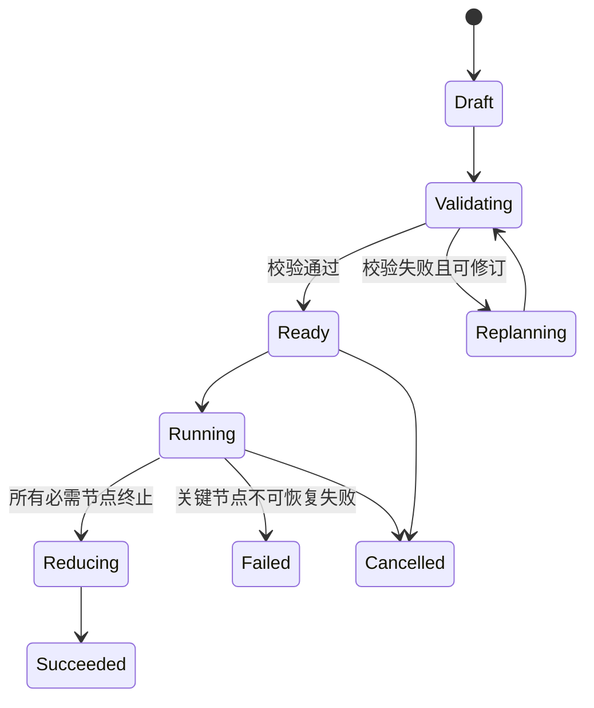

# ModelFlow DAG 架构

## 1. 范围

本文定义 ModelFlow 如何将用户任务生成、验证、执行和归约为有向无环图（DAG）。

节点到具体模型网络节点的注册、健康检查和负载策略见 [MODEL_REGISTRY.md](MODEL_REGISTRY.md)。

系统整体分层与组件职责见 [ARCHITECTURE.md](ARCHITECTURE.md)。

## 2. DAG 的角色

DAG 是用户意图与分布式模型调用之间的标准中间表示。

每个节点代表一个可独立追踪、可调度、可重试的最小工作单元。

每条有向边代表数据或控制上的前置依赖。

图必须无环，以保证所有节点都存在有限的执行顺序。

图的并发度由同一时刻无未满足依赖的节点数量决定。

## 3. 基本术语

`run` 是一次用户请求的完整执行实例。

`dag` 是某个 run 的任务图定义和版本。

`node` 是 DAG 中的逻辑子任务，不等同于物理 Worker。

`edge` 是从上游节点到下游节点的依赖关系。

`attempt` 是一个节点在某个 Worker 上的一次实际执行尝试。

`ready node` 是所有必需依赖均已成功满足、可进入调度的节点。

`terminal node` 是没有下游消费者的节点，通常向最终归约提供输入。

## 4. DAG 生命周期



`Draft` 是 Brain 产生但尚未可信的计划。

`Validating` 阶段执行确定性结构校验和策略约束检查。

`Ready` 表示图定义已经冻结，可以创建节点运行时状态。

`Running` 阶段仅修改节点和 attempt 状态，不就地修改图结构。

如需补充工作，Brain 产生带新版本号的受控扩展图，并保留旧版本审计记录。

## 5. 生成流程

1. Orchestrator 向 Brain 提供用户目标、输入摘要、输出契约和系统约束。
2. Brain 识别任务模式，例如批处理、多视角分析、顺序推理或混合任务。
3. Brain 生成受 JSON Schema 约束的 DAG 草案。
4. DAG Generator 补充系统字段，例如 `dag_id`、版本、节点 ID 与默认策略。
5. Validator 验证结构、依赖、输入绑定、能力约束和资源上限。
6. 校验失败时向 Brain 返回机器可读的错误列表，要求最小化修订。
7. 校验通过后持久化不可变 DAG Snapshot，并计算初始 ready 集合。
8. Scheduler 从 ready 集合开始分派节点；后续由依赖完成事件持续推进。

## 6. Brain 的生成约束

Brain 必须输出 JSON，不得以自然语言隐含节点或依赖。

一个节点必须有单一、可验证的目标和明确输出契约。

每个节点只能引用已声明的上游输出或 run 输入。

可并发节点不得依赖彼此的未完成结果。

深度推理节点应消费上游结构化摘要，而非无界拼接原始长文本。

节点数、扇出、最大深度、总 token 预算和单节点超时受系统配置限制。

## 7. 最小 DAG Schema

```json
{
  "dag_id": "dag_01J...",
  "run_id": "run_01J...",
  "version": 1,
  "user_goal": "分析评论并给出改进建议",
  "nodes": [
    {
      "id": "extract_batch_01",
      "type": "parallel",
      "capability_required": ["information_extraction"],
      "input": {"source_ref": "input.comments[0:100]"},
      "output_contract": "review_findings.v1",
      "depends_on": [],
      "timeout_ms": 5000,
      "retry_policy": {"max_attempts": 2}
    }
  ],
  "final_reduce": {"depends_on": ["extract_batch_01"]}
}
```

实现可增加字段，但不得删除上述运行语义所需字段。

`input` 应使用结构化引用或内联的小型 JSON，而不是未受控的提示词拼接。

`output_contract` 指向可验证的命名 Schema 版本。

## 8. 节点通用字段

| 字段 | 含义 |
| --- | --- |
| `id` | DAG 内唯一、稳定的节点标识 |
| `type` | 执行语义与策略类型 |
| `name` | 面向用户和观测系统的简短名称 |
| `objective` | 该节点唯一职责 |
| `depends_on` | 上游节点 ID 列表 |
| `input` | 输入对象或受控引用 |
| `output_contract` | 结果 Schema 名称与版本 |
| `capability_required` | 必需能力标签集合 |
| `constraints` | 模型、地域、成本或质量约束 |
| `timeout_ms` | 单次 attempt 的截止时间 |
| `retry_policy` | 最大尝试数与重试条件 |
| `priority` | 同一 ready 集合中的相对优先级 |
| `optional` | 是否允许失败后降级继续 |

## 9. 节点类型

### 9.1 `parallel`

`parallel` 用于彼此没有数据依赖的独立任务。

典型场景包括文档分块抽取、区域舆情分析、多个研究视角和批量分类。

所有 ready 的 `parallel` 节点应在配额允许范围内并发提交。

它们可拥有同一个下游归约节点，但不应互相读取结果。

### 9.2 `serial`

`serial` 用于上游结果决定下游输入的顺序工作。

节点只在所有必需依赖成功后成为 ready。

典型场景是术语提取后翻译、事实汇总后策略推演和分阶段推理。

`serial` 表达的是依赖语义，不要求整个 run 只有一个活动节点。

### 9.3 `map`

`map` 是针对集合输入的可扩展扇出节点。

Generator 根据 `partition_spec` 把一个逻辑集合切成多个同构实例节点。

每个实例必须拥有稳定分区键，以支持幂等重试和结果去重。

Map 的子节点通常以 `parallel` 方式执行。

### 9.4 `reduce`

`reduce` 将多个上游的规范化结果合并为一个结构化对象。

它可以执行字段合并、分组、去重、排序、投票和统计。

Reduce 应优先由确定性程序完成；必须调用模型时需明确输出契约。

最终 Reduce 的产物交由 Brain 生成面向用户的表达。

### 9.5 `committee`

`committee` 将同一任务分发给多个候选 Worker 或角色。

它用于高价值结论、多视角论证或降低单模型偶发错误。

委员会成员并发执行，随后由 vote 或 reduce 节点显式汇总。

`committee` 不等同于重复重试，成员应具有可区分的角色、模型或提示策略。

### 9.6 `review`

`review` 检查一个或多个上游结果的事实、格式、覆盖度或一致性。

它产生可操作的问题清单、置信度或批准决定，而非直接静默覆盖原结果。

Review 失败可触发受限的 rework 分支或降级策略。

为保持无环，rework 必须生成新版本的后继节点，不能回连原节点。

### 9.7 `route`

`route` 根据上游的结构化分类结果选择后续分支。

路由规则应尽可能确定性，并记录命中的条件。

未选择的分支标记为 `SKIPPED`，不视为失败。

Route 不允许基于未验证的自由文本直接改变图结构。

### 9.8 `final_reduce`

`final_reduce` 是 run 的逻辑汇点。

它消费所有必需终端结果和允许降级的缺失说明。

该节点负责产出最终上下文包与质量元数据。

最终自然语言回答仍属于 Brain 的呈现职责。

## 10. 依赖关系

一条边写作 `A -> B`，表示 B 在 A 的依赖条件满足前不能执行。

默认依赖是 `success` 依赖，即 A 成功完成后 B 才可就绪。

可选依赖允许 A 失败或跳过后向 B 注入缺失标记。

控制依赖用于强制顺序但不传递业务数据，应谨慎使用。

数据依赖必须声明 B 从 A 的哪个已验证输出字段读取数据。

## 11. 依赖满足规则

节点的必需依赖全部为 `SUCCEEDED` 时，节点状态变为 `READY`。

任一必需依赖为不可恢复的 `FAILED` 时，节点变为 `BLOCKED`。

可选依赖结束后，无论成功或失败，均向下游提供结果或标准缺失对象。

Route 未选中的分支为 `SKIPPED`；依赖该分支的节点只能在规则允许时继续。

一个节点不会因同一上游的重复事件被重复置为 READY。

## 12. 图校验

Validator 必须检查：

- `id` 唯一且命名合法。
- 所有 `depends_on` 均指向当前图中存在的节点。
- 图不存在自环和有向环。
- 所有节点可从输入或根节点到达。
- `final_reduce` 的依赖可覆盖所需终端结果。
- 输入引用指向存在的 run 输入或上游输出契约字段。
- 节点类型、能力标签、超时和重试策略均合法。
- 预算、最大深度、最大扇出和最大并发数未超过限制。
- 任何 `review`、`route` 或扩展机制不会形成隐式循环。

Kahn 拓扑排序可作为无环性与执行层级计算的基础算法。

## 13. 运行时节点状态

```text
PENDING -> READY -> SCHEDULED -> RUNNING -> SUCCEEDED
                               |            |
                               v            v
                            RETRYING      FAILED

PENDING -> BLOCKED
PENDING -> SKIPPED
READY/SCHEDULED/RUNNING -> CANCELLED
```

`PENDING` 表示依赖尚未满足。

`SCHEDULED` 表示 Scheduler 已做出 assignment，但尚未确认执行开始。

`RUNNING` 对应至少一个有效 attempt 正在执行。

`RETRYING` 表示已有失败 attempt，等待新的调度决定。

终态状态不可直接回退；修订工作通过新节点或新 DAG 版本表示。

## 14. 调度输入与输出

Scheduler 的输入是 ready 节点、DAG 约束、运行预算和 Registry 快照。

Scheduler 的输出是一个或多个 `Assignment`。

```json
{
  "assignment_id": "asgn_01J...",
  "run_id": "run_01J...",
  "task_id": "extract_batch_01",
  "worker_id": "worker.shanghai.jetson.03",
  "attempt": 1,
  "deadline_at": "2026-07-26T14:00:05Z",
  "reason": ["capability_match", "low_queue_delay"]
}
```

Assignment 一经提交，Coordinator 负责执行期的超时和回收。

## 15. 调度策略

### 15.1 先满足硬约束

Scheduler 先过滤离线、租约过期、协议不兼容或能力不匹配的 Worker。

随后过滤不满足上下文长度、数据地域、成本上限或模型版本约束的候选。

无候选时节点进入等待或触发明确的降级策略，不可静默选用错误能力。

### 15.2 再做软排序

对候选 Worker 综合估计排队延迟、推理延迟、成功率、成本、负载与数据本地性。

可使用可配置评分函数，而不是将单一模型或硬件写死在 DAG 中。

调度日志应记录每项评分与淘汰原因。

### 15.3 分层并发

同一拓扑层的 READY 节点构成天然并发批次。

Executor 同时受 run、租户、Worker、能力池和全局并发上限约束。

当配额不足时，按优先级、截止时间与估计时长排队。

长任务应避免占满全部槽位，保留配额给短的关键路径节点。

### 15.4 关键路径优先

对决定最终完成时间的节点可给予更高优先级。

关键路径可由剩余 DAG 深度和历史时延估计得到。

该策略不能破坏用户、租户或 Worker 的公平性配额。

### 15.5 推测执行

对高价值且尾延迟明显的节点，可在超过阈值后派发备用 attempt。

最先通过输出校验的结果获胜，其他 attempt 接收取消请求。

推测执行受成本预算和 Worker 容量约束，默认关闭。

### 15.6 重试与重分配

网络瞬断、临时过载和可恢复的格式错误可触发重试。

重试优先选择不同 Worker，以避免重复命中故障域。

业务校验失败是否可重试由节点的 `retry_policy` 明确规定。

每次 attempt 使用同一幂等键和递增 attempt 编号。

## 16. 执行策略与节点类型的关系

`parallel` 强调独立任务的并发执行。

`serial` 强调依赖完成后的顺序推进。

`committee` 强调同一逻辑任务的多候选并发。

`review` 强调质量门控和可解释的问题输出。

`map` 与 `reduce` 共同表达批处理的扇出与汇集。

`route` 允许有限、可审计的条件分支。

一个节点的 `type` 定义语义；Scheduler 决定其具体 Worker 与资源分配。

## 17. 结果契约和输入绑定

每个节点输出必须通过声明的 JSON Schema 验证。

上游结果在进入下游前由 Context Builder 选择字段并附带来源元数据。

下游不能读取未声明的上游自由文本或 Worker 内部日志。

当输出缺少必填字段时，attempt 视为格式失败并按策略处理。

Reducer 应保留 `task_id`、`attempt_id`、时间与置信度，保证结论可回溯。

## 18. 动态扩图

运行中允许 Brain 在受控条件下请求补充节点，例如证据不足后的补检。

扩图请求必须声明触发原因、预算增量、新节点输入和新增边。

Validator 对扩图后的完整图再次执行无环、预算和引用校验。

新节点仅可依赖已完成节点或同次扩图中的前序节点。

不可修改已完成节点的输入、输出或历史状态。

扩图应创建新 `dag.version`，并向客户端发布版本变化事件。

## 19. 取消和恢复

取消 run 时，未开始节点标记为 `CANCELLED`，运行中的 attempt 接收取消信号。

不能取消的底层模型调用在返回后被丢弃，且不得驱动下游状态。

Coordinator 可从持久化的 DAG 与 attempt 日志恢复未完成运行。

恢复时要重新确认 Worker 租约和 assignment 是否仍有效。

结果已持久化的成功节点不应重复执行，除非显式要求重算。

## 20. 质量门控

每个节点至少进行 JSON 格式和输出 Schema 校验。

重要节点可增加证据数量、字段覆盖率、置信度下限或 review 要求。

委员会结果必须说明采纳、分歧和未解决风险。

最终归约必须显式处理 optional 节点的失败或缺失，不能假设其成功。

质量门控失败属于明确领域事件，可被可视化和审计。

## 21. 性能度量

单个节点记录排队时间、执行时间、重试时间与输出大小。

每个 DAG 记录拓扑深度、最大并发度、关键路径估计和实际墙钟时间。

并发加速比定义为可比较串行基线耗时除以实际端到端耗时。

报告加速比时必须同时给出输入规模、Worker 数量、失败重试与降级情况。

## 22. PoC 建议

PoC 优先支持 `parallel`、`serial`、`map`、`reduce` 和 `final_reduce`。

委员会、审查、路由和动态扩图可作为第二阶段能力实现。

首个 Demo 宜选评论批处理或多视角研报等依赖清晰的任务。

生成端必须采用固定 Schema 与静态校验，不以“模型通常会输出正确 JSON”为前提。

## 23. 验收条件

- 任意合法 DAG 均可被拓扑排序，非法环路被拒绝。
- 无依赖节点可以在资源允许时并发执行。
- 下游节点仅在所需上游结果满足后进入 READY。
- Worker 超时或失败可依策略重试、重分配或降级。
- 每个最终字段可追溯到产生它的节点和 attempt。
- DAG 版本、状态变化和调度决策可被 Web Demo 实时展示。
