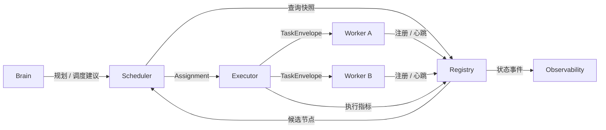
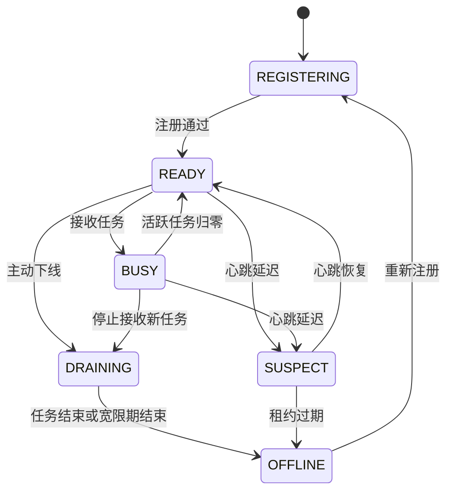

# ModelFlow 模型注册中心与模型互联网设计

## 1. 范围

本文定义 ModelFlow 如何发现、描述、监控和选择模型互联网中的 Brain、Worker 与 Capability。

本文覆盖注册、心跳、租约、负载、健康、能力匹配和负载均衡。

DAG 中节点的生成、依赖和执行语义见 [DAG_ARCHITECTURE.md](DAG_ARCHITECTURE.md)。

整体系统组件和调用边界见 [ARCHITECTURE.md](ARCHITECTURE.md)。

## 2. 模型互联网定义

模型互联网是由多个可独立部署、可动态上下线的模型服务组成的计算网络。

网络节点可运行在 CPU 主机、GPU 服务器、Jetson、树莓派或托管推理服务上。

节点可以异构：模型家族、量化方式、上下文窗口、速度、成本、网络位置均可不同。

Model Registry 使这些差异成为可查询、可比较和可调度的结构化信息。

Registry 是控制面目录，不承载用户模型推理流量。

## 3. 设计目标

- 支持 Worker 和 Brain 的动态注册、更新与注销。
- 用版本化 Capability 描述可执行的任务能力。
- 通过心跳和租约判断节点实时可用性。
- 向 Scheduler 提供一致、可过滤的候选节点快照。
- 结合硬约束、负载和性能实现可解释的负载均衡。
- 隔离节点凭证、传输差异和故障域。
- 支持 PoC 的简单部署，并保留扩展到分布式控制面的路径。

## 4. 核心概念

`Model Node` 是一个可注册的模型服务实体。

`Brain` 是负责全局规划、调度建议和最终聚合的高能力模型角色。

`Worker` 是执行边界清晰子任务的可调度计算节点角色。

`Capability` 是可声明、可匹配、带版本的任务能力，而非模糊的模型名称。

`Endpoint` 是可调用的网络地址及其协议、认证和并发限制。

`Lease` 是节点在线资格的有限期证明，由心跳续约。

`Registry Snapshot` 是某一版本的可用节点视图，供一次调度决策使用。

## 5. 控制面关系



Registry 不替代 Scheduler 做 DAG 级决策。

Scheduler 不直接维护心跳表，也不以固定地址调用 Worker。

Executor 可上报实际调用结果，使 Registry 的性能画像随时间更新。

## 6. Brain 设计

### 6.1 Brain 的定位

Brain 是逻辑角色，不要求全网只有一个物理模型。

它承担自然语言理解、计划生成、异常决策、质量策略和最终表达。

Brain 不应承担大规模重复抽取、批处理或全部子任务的具体推理。

在 PoC 中可配置一个主 Brain；生产形态可注册多个兼容 Brain。

### 6.2 Brain 能力

Brain 应发布 `task_planning`、`dag_generation`、`result_synthesis` 等 Capability。

可选发布 `replanning`、`quality_review`、`strategy_reasoning` 与 `tool_use`。

Brain 的模型档案需要包含上下文窗口、结构化输出可靠性、推理延迟和成本等级。

Planner 与 final reducer 可由同一个 Brain 服务提供，也可按能力拆分。

### 6.3 Brain 高可用

主 Brain 不可用时，控制平面可从具备兼容 Capability 的候选中选择备用 Brain。

切换前必须确认模型版本和计划 Schema 兼容。

已生成的 DAG 继续按快照执行，不应因 Brain 短暂不可用而停止。

只有需要重规划、审查或最终自然语言表达时才需要重新选择 Brain。

## 7. Worker 设计

### 7.1 Worker 的定位

Worker 是实际执行 DAG 节点的最小可调度服务单元。

它接收标准 TaskEnvelope，只处理声明支持的 Capability。

它返回标准 TaskResult、资源指标与错误分类。

Worker 不读取全局 DAG，不决定任务依赖，也不直接调用其他 Worker。

### 7.2 Worker 的最小职责

- 在认证后注册自身元数据和能力。
- 周期性发送心跳并续约。
- 接收有截止时间和幂等键的任务。
- 在并发容量内执行任务或明确拒绝过载请求。
- 按输出契约返回结构化结果或统一错误。
- 上报队列深度、活跃任务数、时延与资源利用率。

### 7.3 Worker 隔离

Worker 可封装本地模型、远程 API 或协作模块。

所有供应商差异由 Worker Adapter 或节点自身适配，不泄漏给 Scheduler。

同一物理主机上的不同模型实例应使用不同 `worker_id` 和独立容量。

Scheduler 可通过 `failure_domain` 避免把冗余 attempt 放到同一主机或网络域。

## 8. Capability 模型

Capability 是调度的主要匹配单元，不应仅使用模型品牌或参数量。

一个 Capability 包含语义名称、版本、输入 Schema、输出 Schema 和质量约束。

示例能力包括：

- `information_extraction.v1`
- `text_classification.v1`
- `sentiment_analysis.v1`
- `summarization.v1`
- `translation.zh_en.v1`
- `structured_json_generation.v1`
- `strategy_reasoning.v1`
- `quality_review.v1`

Capability 名称应稳定、面向任务语义，并以版本表达非兼容变更。

## 9. Capability 描述

```json
{
  "name": "information_extraction",
  "version": "v1",
  "input_schema": "document_chunk.v1",
  "output_schema": "extraction_result.v1",
  "constraints": {
    "languages": ["zh", "en"],
    "max_input_tokens": 8192,
    "structured_output": true
  },
  "quality_hints": {
    "expected_precision": 0.9,
    "expected_latency_ms": 2500
  }
}
```

Schema 是跨节点互操作的契约，不是仅用于文档展示的标签。

Worker 只能声明其可稳定满足的能力与输入限制。

Registry 应拒绝缺少必填 Schema 或版本信息的 Capability 声明。

## 10. Node Record

```json
{
  "worker_id": "worker.cn-shanghai.jetson-03.extractor",
  "role": "worker",
  "display_name": "Jetson Extractor 03",
  "endpoints": [{"protocol": "https", "url": "https://node.example/v1/tasks"}],
  "capabilities": [{"name": "information_extraction", "version": "v1"}],
  "resources": {"max_concurrency": 2, "context_window": 8192},
  "location": {"region": "cn-shanghai", "zone": "lab-a"},
  "failure_domain": "host:jetson-03",
  "status": "READY",
  "lease_expires_at": "2026-07-26T14:05:00Z"
}
```

`worker_id` 必须全局唯一且在节点生命周期内稳定。

节点可更新端点、能力和容量，但变更必须产生新的记录版本。

## 11. 注册协议

Worker 启动后使用节点凭证调用注册接口。

注册请求至少包含身份、角色、端点、能力、资源、位置和协议版本。

Registry 验证凭证、字段完整性、能力 Schema 和端点安全策略。

注册成功后返回 `lease_id`、心跳间隔、过期时间和记录版本。

同一稳定 `worker_id` 的重复注册应幂等更新，而非创建幽灵节点。

节点优雅退出时调用注销接口；异常退出由租约过期处理。

## 12. 心跳与租约

心跳是节点对 Registry 的在线续约和轻量状态报告。

节点应在租约到期前按系统给定间隔发送心跳，并带上 `lease_id` 与记录版本。

心跳不应用来传输大体积日志或完整模型配置。

连续心跳缺失时，节点状态从 `READY` 或 `BUSY` 进入 `SUSPECT`，租约到期后进入 `OFFLINE`。

`SUSPECT` 节点不接收新的普通任务，但已有 attempt 可等待短暂宽限期。

`OFFLINE` 节点立即从可调度候选集移除。

## 13. 心跳负载

```json
{
  "worker_id": "worker.cn-shanghai.jetson-03.extractor",
  "lease_id": "lease_01J...",
  "sequence": 412,
  "timestamp": "2026-07-26T14:00:00Z",
  "status": "BUSY",
  "active_tasks": 2,
  "queue_depth": 1,
  "max_concurrency": 2,
  "metrics": {
    "avg_latency_ms_5m": 2310,
    "error_rate_5m": 0.01,
    "tokens_per_second": 48
  }
}
```

`sequence` 单调递增，用于识别乱序心跳。

Registry 只接受比当前记录更新的同租约心跳。

节点时钟偏差不应单独导致下线；以 Registry 接收时间判定租约更可靠。

## 14. 节点状态机



`DRAINING` 节点允许完成已有任务，但 Scheduler 不再派发新任务。

`BUSY` 不表示不可用；是否可继续接收任务取决于容量和队列策略。

状态变更必须发出事件，供 Scheduler 缓存失效和 Demo 展示。

## 15. 可用性判定

节点能被调度必须同时满足以下条件：

- 状态为 `READY` 或未满容量的 `BUSY`。
- 租约有效，且未被管理员隔离。
- 能力、版本、输入输出 Schema 均兼容。
- 端点协议与任务所需数据策略兼容。
- 上下文窗口、token 预算、地域和模型约束均满足。
- 当前错误率和排队压力未触发熔断阈值。

可用性是 Scheduler 的硬过滤条件，性能仅用于后续排序。

## 16. 负载模型

Registry 为每个节点维护声明容量和观测负载。

声明容量包括 `max_concurrency`、最大输入 token、可选的速率限制和内存预算。

观测负载包括活跃任务数、队列深度、CPU/GPU 利用率、显存余量和网络延迟。

推理模型的活跃任务数通常比瞬时 GPU 利用率更适合做近实时调度信号。

负载数据带时间戳和 TTL，过期数据只能作为降级参考。

## 17. 性能画像

Registry 可从心跳和 Execution Coordinator 的事实记录计算性能画像。

建议按 Capability、输入规模桶和 Worker 分别统计 P50/P95 时延、成功率和吞吐。

令牌速度、首 token 时延和结构化输出通过率对生成任务尤为重要。

画像应使用滑动窗口和最小样本数，避免一次异常永久影响路由。

新 Worker 没有足够样本时使用保守默认值，并限制其初始流量。

## 18. 候选筛选

Scheduler 查询 Registry 时提交角色、能力、版本、输入尺寸和运行约束。

Registry 返回满足硬条件的候选集及其快照版本，而非直接返回唯一节点。

示例查询条件包括：

```json
{
  "role": "worker",
  "capability": {"name": "sentiment_analysis", "version": "v1"},
  "min_context_window": 4096,
  "region_allowlist": ["cn-shanghai", "cn-hangzhou"],
  "require_structured_output": true
}
```

Scheduler 应把该快照版本写入 Assignment，保证决策可复现。

## 19. 负载均衡目标

负载均衡不是简单的轮询。

它首先保证能力和数据约束正确，再优化响应时间、成功率、成本和公平性。

系统目标是降低端到端关键路径时延，而不是只最小化单个 Worker 的 CPU 利用率。

任何负载均衡策略都必须尊重 Worker 容量、租户配额和失败域隔离。

## 20. 负载均衡策略

### 20.1 轮询

同质、低负载 Worker 可使用加权轮询作为简单基线。

权重来自声明容量或经过验证的吞吐能力。

它实现简单，但无法对实时排队和尾延迟做出充分响应。

### 20.2 最少活动任务

在能力相同的候选中优先选择 `active_tasks / max_concurrency` 最低的节点。

该策略适合执行时长相近的 PoC 批处理任务。

应结合队列深度，避免把排队任务隐藏在低活跃数节点中。

### 20.3 最短预计完成时间

为候选估算 `queue_delay + inference_latency + network_latency`。

选择预计完成时间最短的节点可以更直接降低 DAG 关键路径耗时。

估计依赖可靠的性能画像；画像不足时回退到保守权重。

### 20.4 加权评分

生产策略可采用可配置评分：

```text
score = w_latency * predicted_latency
      + w_load * utilization
      + w_error * error_rate
      + w_cost * estimated_cost
      + w_network * network_distance
```

最低分候选获选，权重按任务类型、优先级和租户策略配置。

评分项与最终选择必须记录到调度事件中。

### 20.5 一致性路由

当任务需要缓存亲和性、会话状态或术语一致性时，可按业务键一致性哈希。

一致性路由只能在能力匹配的候选子集中进行。

节点下线时应平滑迁移，并确保任务输入仍然满足数据隔离要求。

### 20.6 冗余与尾延迟控制

关键且耗时不稳定的任务可在超过分位阈值后启动备用 attempt。

备用 Worker 必须位于不同 failure domain，且受到预算限制。

最先返回并通过 Schema 校验的结果获胜，其余 attempt 被取消或忽略。

## 21. 熔断与隔离

当某 Worker 在窗口内错误率、超时率或格式失败率超过阈值时，Registry 标记为 `DEGRADED` 或隔离。

隔离节点不进入普通候选集，直到主动恢复或观察窗口证明其健康。

熔断判断应按 Capability 分维度，避免某个能力故障误伤节点的其他稳定能力。

管理员可手动执行 `DRAINING`、隔离和恢复，并留下审计事件。

## 22. 数据一致性与缓存

Registry 对单节点记录使用乐观版本或比较交换，拒绝过期心跳覆盖新状态。

Scheduler 可缓存只读快照以降低查询压力，但必须遵守短 TTL。

若 Assignment 提交时发现 Worker 已离线或容量耗尽，Coordinator 返回可重调度的拒绝事件。

强一致不是每次调度的前提；正确的过期处理和幂等重调度更重要。

## 23. 安全设计

每个节点使用独立身份凭证注册和续约，禁止共享静态通用密钥。

注册、心跳与任务调用应使用 TLS，并校验服务端与客户端身份。

端点 URL、模型版本和 Capability 更新属于受审计的控制面变更。

Registry 不应保存 Worker 的长期供应商密钥或用户原始数据。

按租户或数据级别限制候选范围，避免不合规跨域调度。

## 24. 事件模型

Registry 至少发布以下事件：

- `worker.registered`
- `worker.updated`
- `worker.heartbeat_received`
- `worker.status_changed`
- `worker.lease_expired`
- `worker.draining`
- `worker.offline`
- `worker.quarantined`
- `capability.changed`
- `scheduler.snapshot_created`

事件包含 `event_id`、时间、实体 ID、旧状态、新状态和关联 `trace_id`。

事件消费者必须以 `event_id` 幂等处理。

## 25. API 草案

| 方法 | 路径 | 用途 |
| --- | --- | --- |
| `POST` | `/v1/registry/nodes` | 注册或更新节点 |
| `POST` | `/v1/registry/nodes/{id}/heartbeat` | 续约并上报轻量指标 |
| `POST` | `/v1/registry/nodes/{id}/drain` | 停止接收新任务 |
| `DELETE` | `/v1/registry/nodes/{id}` | 优雅注销节点 |
| `GET` | `/v1/registry/nodes` | 按能力和约束查询候选集 |
| `GET` | `/v1/registry/nodes/{id}` | 查询节点及健康详情 |
| `GET` | `/v1/registry/snapshots/{version}` | 查询调度使用的历史快照 |

所有写接口均需节点或管理员身份认证。

查询接口必须支持 `role`、Capability、状态、地域和版本过滤。

## 26. PoC 实现建议

PoC 可先使用一个持久化表保存 Node Record 和租约信息。

每个 Worker 每 5 到 10 秒心跳一次，租约可设为 3 倍心跳间隔。

Scheduler 首先实现能力匹配加最少活动任务策略。

Execution Coordinator 将实际成功、失败和时延写回观测数据。

Web Demo 展示节点角色、能力、在线状态、活跃任务、时延和当前 assignment。

不要在 PoC 中把注册中心设计成模型推理消息总线。

## 27. 验收条件

- 新 Worker 无需重启调度器即可完成注册并参与候选筛选。
- 租约过期的 Worker 会自动从新任务候选集中移除。
- Scheduler 只能选择 Capability 与约束均匹配的节点。
- Worker 负载和历史性能会影响同能力候选间的选择。
- 节点故障、隔离、重连与版本变化对运行记录可追溯。
- 主 Brain 故障不会损坏已冻结的 DAG 和已完成的 Worker 结果。
