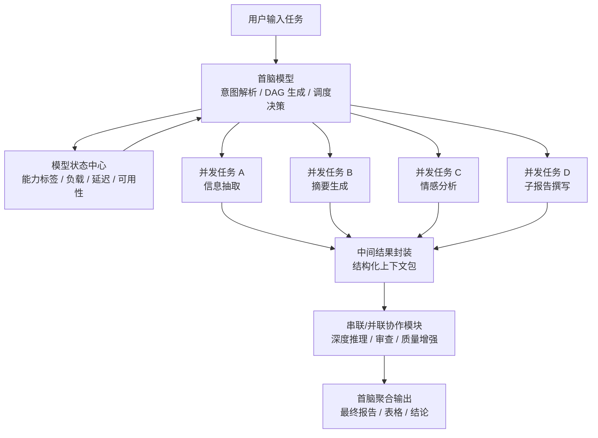
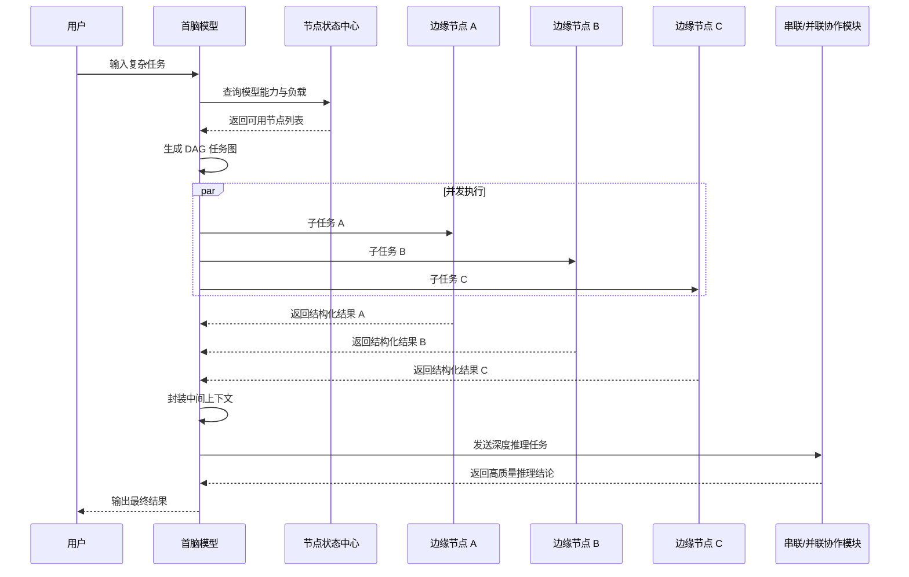

# 基于模型互联网的动态混合 DAG 调度引擎项目方案

## 1. 项目标题

**项目名称：ModelFlow：基于模型互联网的动态混合 DAG 调度引擎**

**一句话概括：**  
面向模型互联网中的异构中小模型节点，构建一个由“首脑模型”负责规划、拆解、路由和聚合的通用任务调度系统，使复杂任务中可并发的部分由多个小模型同时处理、不可并发的部分交给串行/并联协作机制深度推理，从而在保证结果可用的前提下显著降低响应时间。

**定位关键词：**

- 模型互联网应用
- Auto-Multi-Agent
- 异构模型调度
- 混合 DAG 任务编排
- 并发提速
- 串行深推
- 边缘节点协同
- 通用型模型路由框架

## 2. 项目背景与问题判断

当前很多模型协作方案主要围绕“串联协作”“并联投票”“多模型聚合”展开，其核心目标通常是提升回答质量或增强稳定性。但在真实用户体验和商业落地中，这类方案会遇到几个明显问题：

1. **如果只拼质量，难以正面击败大厂通用大模型。**  
   GPT、Gemini、DeepSeek、Qwen 等强模型在通用问答、复杂推理、代码生成、写作等任务上具备参数规模、数据和算力优势。若模型互联网只是用多个中小模型拼接答案，很容易陷入“为了协作而协作”的伪需求。

2. **如果只强调隐私，商业 API 已经覆盖多数普通需求。**  
   企业级 API 通常承诺不使用用户数据训练模型。对大多数普通企业和个人用户而言，这种隐私保护已经足够。因此，仅以“比 API 更隐私”为卖点，用户迁移动力不足。

3. **如果前端仍是普通 Chat，用户感知不到后端协作。**  
   用户输入一句话、系统输出一段话时，用户并不关心后端是一个模型还是十个模型。若多模型协作带来更高延迟，反而会降低体验。

因此，本项目不把竞争点放在“多模型一定比单模型聪明”，而是换一个突破口：**效率。**

模型互联网当前部署了大量中小参数模型，运行在树莓派、Jetson、4090 等不同硬件节点上。中小模型的最大特点不是全能，而是**轻、快、可并发、可分布式部署**。本项目正是要利用这一点，把模型互联网从“多个模型一起想答案”升级为“多个模型像分布式计算节点一样协同处理任务”。

## 3. 核心立意

本项目的核心立意是：

**不与单体大模型比单点智力，而是利用模型互联网的多节点结构，以空间换时间，将复杂任务中的可并发部分拆解并发执行，从而突破单体大模型串行生成的响应延迟。**

单体大模型再强，也存在一个天然限制：大多数文本生成过程是自回归的，即 Token-by-Token 串行生成。复杂任务一旦需要输出大量内容、处理大量独立样本、分析多个维度，大模型往往只能依次完成。

ModelFlow 的思路是：让“首脑模型”先把任务拆成有依赖关系的 DAG 图，再把可并发的节点分派给多个边缘小模型同时执行。对于确实需要深度推理、前后依赖强、不能简单并行的部分，再调用实验室已有的串联/并联协作方案进行质量增强。

换言之，本项目不是否定同门已有的串并联协作，而是把它们纳入更大的调度体系中：

- **并发节点：** 解决广度任务、批处理任务、多视角任务，追求速度。
- **串行/并联协作节点：** 解决深度推理任务、质量审查任务、逻辑递进任务，追求质量。
- **首脑模型：** 负责判断每个任务节点该走哪种执行方式，并完成最终聚合。

## 4. 系统总体目标

ModelFlow 要实现的不是某一个固定应用，而是一套面向模型互联网的通用任务调度能力。它应支持：

1. **任意自然语言任务输入。**  
   用户不需要手动指定并发或串行，系统自动分析任务结构。

2. **动态任务拆解。**  
   首脑模型将任务拆解为多个子任务，并生成包含依赖关系的 DAG。

3. **模型能力感知。**  
   系统掌握当前模型互联网中各节点的能力标签、硬件类型、负载状态、响应速度、上下文长度等信息。

4. **混合执行。**  
   可并发部分并发执行，不可并发部分串行执行；需要高质量推理的部分可路由到已有串联/并联协作模块。

5. **结构化通信。**  
   首脑给每个节点下发清晰的目标、输入、输出格式和约束，节点返回标准化结果，便于聚合。

6. **最终结果聚合。**  
   首脑回收所有子任务结果，完成去重、整合、摘要、排序、推理或报告生成。

7. **可视化演示。**  
   系统以动态拓扑图展示任务拆解、任务传输、节点执行、结果回收和最终聚合过程，让评委直观看到模型互联网的并发优势。

## 5. 系统角色设计

### 5.1 首脑模型

首脑模型运行在较强算力节点上，例如 4090 服务器或其他高性能 GPU 节点。它不负责完成所有具体任务，而是承担“项目经理”和“调度中枢”的角色。

主要职责：

- 解析用户意图。
- 判断任务是否可拆解。
- 识别任务中可并发和不可并发的部分。
- 生成 DAG 任务图。
- 读取当前模型节点的能力、负载与可用状态。
- 为每个子任务选择合适模型节点。
- 为每个模型生成明确的任务指令，包括目标、输入、输出格式、字数限制和超时时间。
- 处理节点返回结果。
- 决定是否需要补跑、重分配或进入串行深推。
- 生成最终答案。

### 5.2 边缘模型节点

边缘模型节点可以运行在树莓派、Jetson、普通 GPU 服务器或其他可接入模型互联网的设备上。它们通常部署中小参数模型，优势是响应快、成本低、可以多节点同时工作。

主要职责：

- 接收首脑下发的子任务。
- 只处理明确、范围小、输出格式清晰的任务。
- 在限定时间和限定 Token 数内返回结构化结果。
- 上报自身状态，包括忙闲状态、平均延迟、最近错误率、可承接任务类型等。

典型能力标签：

- 摘要生成
- 信息抽取
- 情感分析
- 关键词提取
- 文本分类
- 分块翻译
- 简单问答
- 结构化 JSON 生成
- 事实列表整理
- 子报告撰写

### 5.3 串联/并联协作模块

该模块可以复用实验室同门已有方案。它不是 ModelFlow 的竞争者，而是 ModelFlow 的子能力。

适合处理：

- 强逻辑依赖任务
- 多轮反思任务
- 需要交叉审查的答案
- 需要多个模型互相质疑、补充、修正的高质量推理任务
- 最终结论生成前的质量增强环节

## 6. 核心运行机制：混合 DAG 调度

ModelFlow 的关键不是简单地“把任务一分为二”，而是把复杂任务表示为一张有向无环图。图中每个节点是一个子任务，边表示依赖关系。

如果多个节点之间没有依赖关系，它们就可以并发执行；如果某个节点依赖上游结果，则必须等待上游完成后再执行。

### 6.1 工作流

1. **任务输入。**  
   用户输入自然语言任务，例如：“分析苹果 Vision Pro 销量下滑原因，并推演下一代产品定价策略。”

2. **首脑解析。**  
   首脑识别该任务包含事实收集、原因归纳、策略推演等部分。

3. **DAG 生成。**  
   首脑生成任务图：销量数据收集、媒体评价总结、用户情绪提取等可以并发；定价策略推演依赖前面的事实结果，需要后置串行推理。

4. **并发分发。**  
   首脑根据节点能力与负载，把可并发任务分给多个小模型。

5. **同步等待。**  
   系统等待并发任务返回。若某节点超时，首脑可丢弃、补跑或重分配。

6. **中间结果封装。**  
   首脑把并发结果整理成标准上下文包。

7. **串行深推。**  
   对需要深度推理的部分，首脑将上下文包交给串联/并联协作模块。

8. **最终聚合。**  
   首脑生成最终报告、摘要、表格或结论。

### 6.2 时间复杂度表达

对于混合任务，整体耗时可表达为：

```text
T_total = T_decompose + max(T_P1, T_P2, ..., T_Pn) + sum(T_S) + T_reduce
```

其中：

- `T_decompose`：首脑拆解任务的时间。
- `max(T_P1, T_P2, ..., T_Pn)`：所有并发子任务中最慢节点的耗时。
- `sum(T_S)`：必须串行执行的任务耗时。
- `T_reduce`：首脑聚合结果的时间。

该公式体现了本项目的核心价值：  
只要任务中存在可并发部分，系统就能把原本需要线性累加的耗时压缩为并发任务中的最大耗时。

## 7. 系统架构图



## 8. 结构化任务协议设计

为了避免首脑和小模型之间通信失控，系统需要规定统一的任务格式。建议首脑输出 JSON 格式的 DAG 任务图。

示例：

```json
{
  "task_id": "vision_pro_analysis_001",
  "user_goal": "分析苹果 Vision Pro 销量下滑原因，并推演下一代产品定价策略",
  "nodes": [
    {
      "id": "p1",
      "type": "parallel",
      "capability_required": ["market_data_summary"],
      "input": "收集并总结 Vision Pro 销量与渠道反馈",
      "output_format": "json",
      "max_tokens": 300,
      "timeout_ms": 5000,
      "depends_on": []
    },
    {
      "id": "p2",
      "type": "parallel",
      "capability_required": ["media_review_summary"],
      "input": "总结科技媒体对 Vision Pro 的主要负面评价",
      "output_format": "json",
      "max_tokens": 300,
      "timeout_ms": 5000,
      "depends_on": []
    },
    {
      "id": "p3",
      "type": "parallel",
      "capability_required": ["sentiment_analysis"],
      "input": "总结用户侧对 Vision Pro 价格、重量、生态的主要情绪",
      "output_format": "json",
      "max_tokens": 300,
      "timeout_ms": 5000,
      "depends_on": []
    },
    {
      "id": "s1",
      "type": "serial_reasoning",
      "capability_required": ["strategy_reasoning"],
      "input": "基于 p1、p2、p3 的结果，推演下一代 Vision 产品定价策略",
      "output_format": "markdown",
      "max_tokens": 800,
      "timeout_ms": 12000,
      "depends_on": ["p1", "p2", "p3"]
    }
  ],
  "final_reduce": {
    "format": "markdown_report",
    "sections": ["核心摘要", "销量下滑原因", "定价策略建议", "风险提示"]
  }
}
```

边缘节点返回结果也应尽量结构化，例如：

```json
{
  "node_id": "p2",
  "status": "success",
  "latency_ms": 2310,
  "result": {
    "main_findings": [
      "设备重量影响长时间佩戴体验",
      "应用生态不足降低复购与推荐意愿",
      "高售价限制大众消费市场扩散"
    ],
    "confidence": 0.82
  }
}
```

## 9. 应用场景设计

本项目当前阶段以纯文本任务为主。未来模型互联网加入多模态模型后，可自然扩展到图像、视频、传感器和机器人控制等场景。

### 9.1 场景一：秒级多维研报生成

**用户任务：**  
“全面评估 Starship 发射对商业航天产业的影响。”

**传统大模型痛点：**

- 需要串行生成长报告。
- 多个维度都由同一个模型依次分析，响应时间长。
- 输出越长，等待越明显。

**ModelFlow 方案：**

首脑将任务拆为多个并发视角：

- 技术可行性分析
- 发射成本与商业化潜力
- 政策与合规风险
- 竞争格局分析
- 对供应链和资本市场影响

各边缘模型同时生成 300 字左右的子报告，首脑最后聚合为完整研报。

**展示亮点：**

- 单体大模型可能需要 30 秒以上生成完整长文。
- 多个小模型并发可在数秒内完成子报告。
- 首脑只需做最终摘要和整合，显著降低总等待时间。

### 9.2 场景二：海量评论批处理与情感分析

**用户任务：**  
“分析 5000 条电商评论，找出用户吐槽最多的 3 个产品缺点，并给出改进建议。”

**传统大模型痛点：**

- 上下文窗口可能装不下全部评论。
- 单体模型处理长输入慢，容易遗忘中间内容。
- 输出不一定结构化，后续统计困难。

**ModelFlow 方案：**

首脑将 5000 条评论切分为 50 份，每份 100 条，分派给 50 个可用节点。每个节点返回标准 JSON：

- 高频缺点词
- 对应评论证据
- 情绪强度
- 代表性用户表达

首脑合并所有 JSON，完成去重、词频统计和最终建议生成。

**展示亮点：**

- 这是典型的 B 端数据流水线任务，现实需求高。
- 每批评论之间相互独立，天然适合并发。
- 输出可生成表格、柱状图或问题 Top 3。

### 9.3 场景三：简历/发票/政务文档信息抽取

**用户任务：**  
“从 1000 份简历中提取候选人的姓名、学历、技能、工作年限，并筛选出符合 Java 后端岗位的人选。”

**传统大模型痛点：**

- 单份文档之间没有强依赖，但单体模型只能排队处理。
- 大量重复性抽取任务浪费强模型算力。
- 如果输出格式不统一，后续人工整理成本高。

**ModelFlow 方案：**

首脑将文档按批次分发给多个节点。边缘小模型负责抽取结构化字段，首脑最终生成候选人表格并排序。

**适用行业：**

- 人力资源
- 财务报销
- 政务材料审核
- 法务合同要素抽取

### 9.4 场景四：跨区域市场舆情分析

**用户任务：**  
“分析某款手机壳在北美、欧洲、东南亚、日韩市场的用户反馈，并给出发货策略。”

**ModelFlow 方案：**

首脑按区域拆解：

- 北美市场反馈
- 欧洲市场反馈
- 东南亚市场反馈
- 日韩市场反馈

各节点并发分析本区域用户评价、价格敏感度、物流痛点和竞品表现。首脑汇总为全球市场洞察报告。

**优势：**

- 各区域分析相互独立，适合并发。
- 结果聚合后可直接服务运营决策。
- 比普通聊天式问答更接近真实业务流程。

### 9.5 场景五：超长文本分块处理

**用户任务：**  
“对一本 500 页英文小说进行章节翻译，并保持术语、人名和风格统一。”

**ModelFlow 方案：**

- 首脑先抽取术语表、人名表和风格约束。
- 将章节分发给多个小模型并发翻译。
- 对关键章节或风格不一致部分调用串行协作模块审查。
- 首脑最终合并全文，并统一术语。

**注意：**

该场景中并发翻译必须处理风格一致性，因此可作为后续增强版 demo；MVP 阶段更推荐评论分析、简历抽取、研报生成等依赖较弱的任务。

## 10. 推荐 MVP 场景

综合当前模型互联网以文本生成模型为主、比赛需要直观演示、系统需要快速落地等因素，建议 MVP 选择：

**海量文本批处理 + 多维报告生成的组合 Demo。**

示例题目：

**“基于模型互联网的电商评论并发分析系统：从 5000 条评论中秒级提取产品缺陷、用户情绪与改进建议。”**

选择理由：

- 数据容易构造。
- 可并发性强。
- 不依赖多模态能力。
- 评委容易理解。
- 能直观展示速度差异。
- 可输出结构化表格、统计图和最终分析报告。
- 与 B 端真实需求贴合。

Demo 可设置两条对比路线：

- **单体模型串行处理：** 逐批处理评论并生成结论。
- **ModelFlow 并发处理：** 首脑切分任务，多节点同时抽取，最终聚合。

最终展示指标：

- 总耗时
- 节点并发数
- 每个节点延迟
- 成功返回比例
- 结构化字段完整率
- 最终报告生成时间
- 相对单体模型的加速比

## 11. 可视化演示方案

可视化是本项目打动评委的关键。因为普通 Chat 输出无法体现模型互联网的协同过程，所以需要把“任务如何在模型网络中流动”动态展示出来。

### 11.1 动态拓扑图

界面核心是一个实时模型网络拓扑状态图：

- 中央是首脑节点。
- 周围是树莓派、Jetson、4090 子节点等边缘模型。
- 每个节点显示当前状态：空闲、接收任务、执行中、已返回、超时、重分配。
- 节点之间的连线显示任务传输方向和结果回传方向。
- 右侧显示 DAG 任务列表和每个子任务状态。
- 底部显示时间轴和加速比。

### 11.2 演示时间轴

```text
t1：用户输入任务，首脑节点亮起，状态为“任务解析中”
t2：首脑生成 DAG，界面出现任务图，标注可并发节点和串行节点
t3：任务传输链路亮起，多个子任务同时发送到边缘模型节点
t4：边缘节点依次亮起，显示“子任务执行中”和实时耗时
t5：部分节点返回结果，链路反向亮起，首脑开始收集中间结果
t6：首脑将并发结果封装为上下文包，并将深推任务交给串行/并联协作模块
t7：串行/并联协作模块返回结论，首脑进入最终聚合
t8：最终结果生成，用户点击查看报告、表格和统计摘要
```

### 11.3 可视化流程图



### 11.4 Demo 页面建议

Demo 页面可包含四个区域：

1. **任务输入区**  
   输入自然语言任务，选择数据集，例如“5000 条评论分析”。

2. **模型网络拓扑区**  
   展示首脑节点、边缘节点、链路动画和节点状态。

3. **DAG 执行区**  
   展示每个子任务的名称、执行方式、依赖关系、分配节点、耗时和状态。

4. **结果对比区**  
   左侧显示单体模型串行处理耗时，右侧显示 ModelFlow 并发处理耗时，并给出加速比。

## 12. 与传统方案对比

| 维度 | 传统大厂单体模型 API | 普通多模型串并联 | ModelFlow 动态混合 DAG 调度 |
|---|---|---|---|
| 核心目标 | 单模型高质量回答 | 多模型聚合提高质量 | 并发提速 + 深度质量增强 |
| 用户感知 | 等待一个答案 | 仍然像等待一个答案 | 可视化看到任务在网络中并发流动 |
| 速度 | 长任务串行生成，耗时明显 | 可能更慢，因为多轮协作 | 可并发部分压缩为最大节点耗时 |
| 硬件利用 | 依赖云端大算力 | 多模型参与但调度粗糙 | 盘活边缘节点和闲置小模型 |
| 适用任务 | 通用问答、写作、推理 | 质量审查、答案投票 | 批处理、多视角、多文档、混合复杂任务 |
| 与实验室成果关系 | 外部竞品 | 单一协作方式 | 可整合同门串联/并联方案 |
| 模型互联网特征 | 不明显 | 有模型协作但缺少网络调度 | 体现模型发现、路由、协作、聚合 |

## 13. 创新点总结

1. **从“质量协作”转向“效率协作”。**  
   不再重复证明多个小模型比大模型更聪明，而是证明多个小模型并发执行能比单体模型更快。

2. **将模型互联网抽象为分布式计算网络。**  
   每个模型不只是回答者，而是可调度的计算节点。

3. **提出首脑驱动的混合 DAG 调度机制。**  
   首脑自动识别任务依赖关系，决定哪些部分并发、哪些部分串行。

4. **兼容同门已有串联/并联协作方案。**  
   本项目不是孤立 demo，而是可以成为实验室多种模型协作方案的上层调度入口。

5. **面向 B 端数据流水线场景。**  
   项目避开普通聊天场景，聚焦海量文本处理、多文档抽取、多维研报等高频真实需求。

6. **强调可视化过程而非黑盒答案。**  
   通过动态拓扑图让评委看到模型互联网的实际运行价值。

## 14. 关键技术难点与应对策略

### 14.1 首脑拆解不稳定

**问题：**  
首脑模型可能无法稳定生成正确 DAG，或把不可并发任务错误拆成并发任务。

**应对：**

- 使用固定 JSON Schema 约束输出。
- 设计任务类型分类器，先判断任务属于批处理、多视角、强推理还是混合任务。
- 对 DAG 做静态校验，检查循环依赖、缺失输入和输出格式错误。
- MVP 阶段限制任务范围，先做高可并发场景。

### 14.2 小模型输出格式失控

**问题：**  
小模型可能不按 JSON 返回，影响首脑聚合。

**应对：**

- 所有子任务强制结构化输出。
- 使用响应解析器和格式修复器。
- 关键字段缺失时自动重试或转派其他节点。
- 限制输出长度，减少跑题。

### 14.3 并发任务粒度过细

**问题：**  
如果拆得太碎，网络通信和调度开销可能超过推理收益。

**应对：**

- 设置最小任务粒度。
- 记录历史任务耗时，学习合适分块大小。
- 对短任务进行批量合并后再分发。
- 在可视化中展示通信耗时，证明系统做了粒度控制。

### 14.4 慢节点拖累整体速度

**问题：**  
并发任务总耗时取决于最慢节点。

**应对：**

- 设置超时时间。
- 支持任务重分配。
- 根据节点历史延迟做调度。
- 对重要任务可分配备份节点，先返回者优先采用。

### 14.5 首脑聚合上下文过大

**问题：**  
大量子任务返回长文本会让首脑聚合压力变大。

**应对：**

- 子任务输出必须短而结构化。
- 对中间结果做二级摘要。
- 聚合阶段优先合并 JSON 字段，而不是直接拼接长文本。
- 限制每个节点返回的 max_tokens。

## 15. 实施路线

### 15.1 第一阶段：概念验证

目标：证明并发调度确实能带来速度优势。

任务：

- 搭建首脑调度脚本。
- 接入若干文本模型节点。
- 维护简单节点注册表，包括节点能力、地址、状态。
- 支持固定任务模板，例如评论分析或多维研报生成。
- 输出 DAG JSON。
- 并发调用节点并聚合结果。
- 记录串行 baseline 与并发方案耗时。

### 15.2 第二阶段：可视化 Demo

目标：让评委直观看到模型互联网的运行过程。

任务：

- 绘制实时拓扑图。
- 展示 DAG 任务节点和依赖关系。
- 展示任务下发、执行、回传、聚合动画。
- 展示各节点耗时和总加速比。
- 支持点击查看每个节点的输入和输出。

### 15.3 第三阶段：混合调度

目标：整合同门串联/并联协作方案。

任务：

- 在 DAG 节点中增加执行类型：parallel、serial、committee、review。
- 将不可并发或高质量要求节点路由到串联/并联协作模块。
- 将并发结果封装成统一上下文包，供串行深推使用。
- 支持复杂任务的多阶段执行。

### 15.4 第四阶段：泛化增强

目标：从固定 demo 走向通用任务调度框架。

任务：

- 增加任务类型识别。
- 增加模型能力画像。
- 根据历史运行数据优化调度策略。
- 加入多模态节点后扩展到图片、音频、视频和传感器任务。

## 16. 答辩叙事建议

答辩时可以围绕以下逻辑展开：

1. **先指出行业痛点：**  
   传统多模型协作容易陷入“卷质量”的误区，无法正面击败大厂单体大模型。

2. **再提出换道竞争：**  
   模型互联网的真正优势不是单点智力，而是多节点、异构、可并发、可调度。

3. **接着解释系统机制：**  
   首脑模型把任务转成 DAG，可并发部分交给多个边缘小模型，不可并发部分交给串联/并联协作模块。

4. **然后展示真实场景：**  
   海量评论、简历抽取、多维研报、跨区域市场分析都是现实中的高频并发任务。

5. **最后展示 Demo 和指标：**  
   动态拓扑图证明模型互联网真的在协作，耗时对比证明系统真的更快。

核心表达可以是：

> 我们不是要证明多个小模型比 GPT 更聪明，而是要证明在模型互联网里，多个小模型可以比一个大模型更快地完成那些天然可并发的真实任务。ModelFlow 做的事情，就是让模型互联网从“模型集合”变成“可调度的模型计算网络”。

## 17. 最终项目定义

ModelFlow 是一个面向模型互联网的动态混合 DAG 调度引擎。它以首脑模型为调度中心，感知全网模型节点的能力与负载，将用户输入的复杂任务自动拆解为有依赖关系的任务图。系统对可并发节点进行多模型并行分发，对不可并发或高质量要求节点调用串联/并联协作机制，最终由首脑模型完成统一聚合输出。

该方案的核心价值在于：  
**把模型互联网中大量中小模型“快、轻、分布式”的特点转化为用户可感知的响应速度优势，同时兼容已有多模型质量增强方案，形成一个兼具速度、质量和扩展性的通用模型调度框架。**

